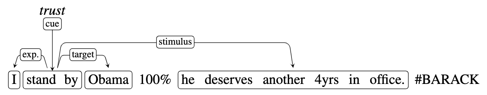
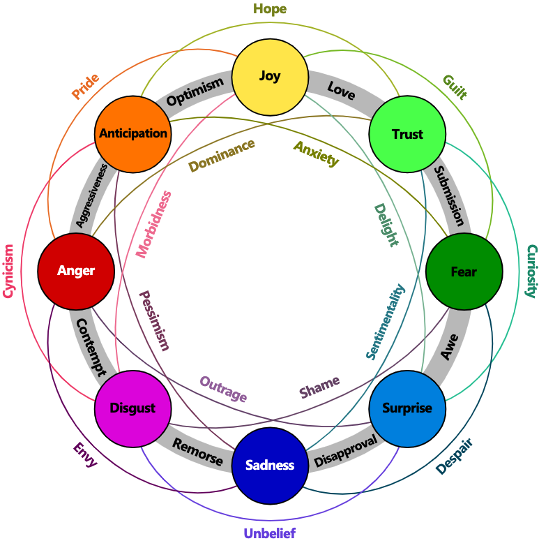

# SRL4E - Data
In this page you will find important information about the resources included in SRL4E and the instructions to reproduce the benchmark.

## Annotation
SRL4E is composed of several resources, but they share a similar argument structure. In the following table we formalize this structure, according to the scheme adopted in SRL4E:
| Role | Definition |
| :----- | :----- |
|Cue| Trigger word or expression that describes (even implicitly) an emotion. |
|Experiencer| Person or entity that feels or experiences the emotion identified by the cue. |
|Target| Person or entity towards whom/which the emotion identified by the cue is directed. | 
|Stimulus| Entity, action or event that causes the emotion identified by the cue. |

This argument structure should be interpreted as in the example below.  
  
The Cue expression is “stand by”, and its associated emotion is Trust. 
The participants to the emotion are “I” (Experiencer of Trust), “Obama” (Target of Trust), and “he deserves another 4yrs in office” (Stimulus of Trust).

Each dataset uses different categories of emotions. In SRL4E we set up a set that is valid in most cases, and map all resources to it. 
This schema is based on [Plutchik](https://en.wikipedia.org/wiki/Robert_Plutchik)'s [wheel of emotions](https://en.wikipedia.org/wiki/Robert_Plutchik#Plutchik's_wheel_of_emotions). 
It provides clearly distinct and well-defined coarse-grained categories: anger, anticipation, disgust, fear, joy, sadness, surprise and trust. 
These categories can be compounded into dyads to virtually describe all other fine-grained sets, and to form even more complex feelings, as in the image below.  
  
The following table summarizes which annotations form part of the original corpora and, therefore, which ones are also part of SRL4E.
|Resource| Cue | Stimulus | Experiencer | Target|
| ------ | :------: | :------: | :------: | :------: |
|Blogs | :heavy_check_mark:  | – | – | – |
|Elections  | :heavy_check_mark: | :heavy_check_mark: | :heavy_check_mark: | :heavy_check_mark: |
|EmoTweet   | :heavy_check_mark: | – | – | – |
|GNE        | :heavy_check_mark: | :heavy_check_mark: | :heavy_check_mark: | :heavy_check_mark: |
|NTCIR      | :heavy_check_mark: | :heavy_check_mark: | – | – |
|REMAN      | :heavy_check_mark: | :heavy_check_mark: | :heavy_check_mark: | :heavy_check_mark: |

## Instructions
Coming soon!

## Resource Licenses and Links
The following table summarizes license information, availability and link for each dataset that is part of SRL4E. 

| Resource        | Source       | License     | Link |
| ----------- | ----------- | :-----------: | ------------- |
| Blogs      | [Aman and Szpakowicz (2007)](https://doi.org/10.1007/978-3-540-74628-7_27) |**R-R**| Contact authors (as described [here](http://saimacs.github.io/)) | 
| Elections   | [Mohammad et al. (2014)](https://aclanthology.org/W14-2607/) |**D-R**|[Link](http://saifmohammad.com/WebPages/SentimentEmotionLabeledData.html)|
| EmoTweet      | [Liew et al. (2016)](https://www.aclweb.org/anthology/L16-1183)       |**R-R**| Email authors | 
| GNE      |  [Bostan et al. (2020)](https://www.aclweb.org/anthology/2020.lrec-1.194)       |**D-C**| [Link](https://www.ims.uni-stuttgart.de/en/research/resources/corpora/goodnewseveryone/) | 
| NTCIR      | [Gao et al. (2017)](https://research.nii.ac.jp/ntcir/workshop/OnlineProceedings13/pdf/ntcir/01-NTCIR13-OV-ECA-GaoQ.pdf)       |**D-U**| [Original link (broken)](http://hlt.hitsz.edu.cn/ECA.html) and [Archive.org link](https://web.archive.org/web/20170913034355/http://hlt.hitsz.edu.cn/ECA.html) | 
| REMAN      | [Kim and Klinger (2018)](https://aclanthology.org/C18-1114/)       |**D-C**| [Link](https://www.ims.uni-stuttgart.de/en/research/resources/corpora/reman/) | 

Where:
- **R-R**: available upon **R**equest for **R**esearch only purposes; 
- **D-R**: available online for **D**ownload for **R**esearch only purposes; 
- **D-U**: available online for **D**ownload with **U**nknown license;
- **D-C**: available online for **D**ownload under **C**C-BY 4.0 license.

